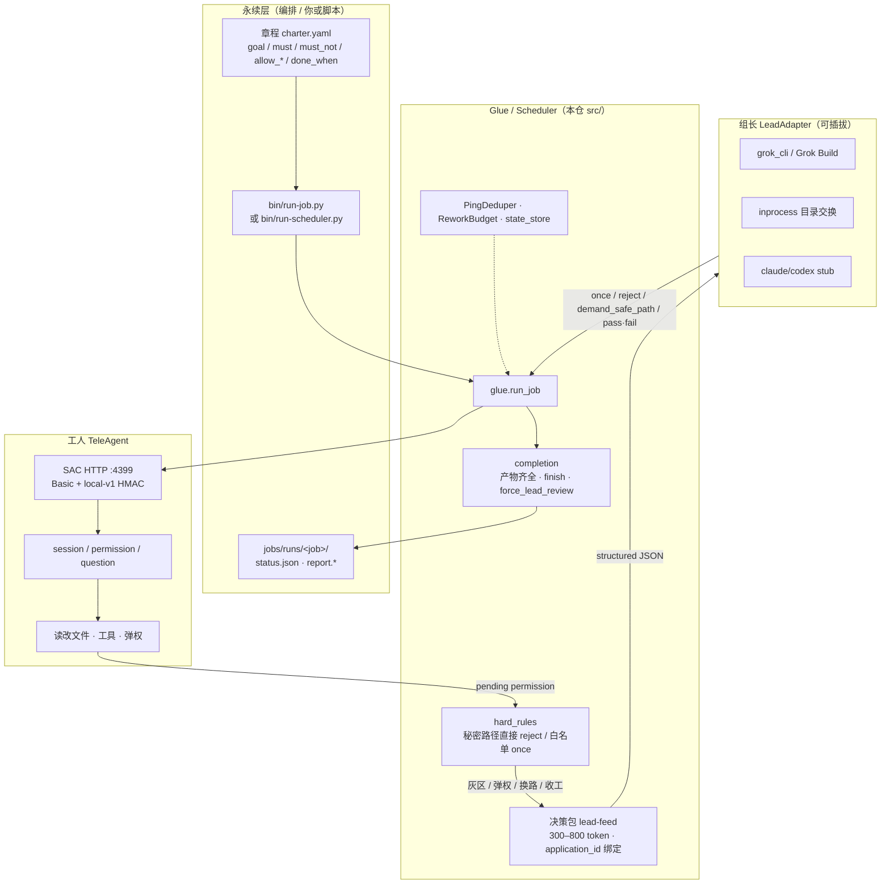
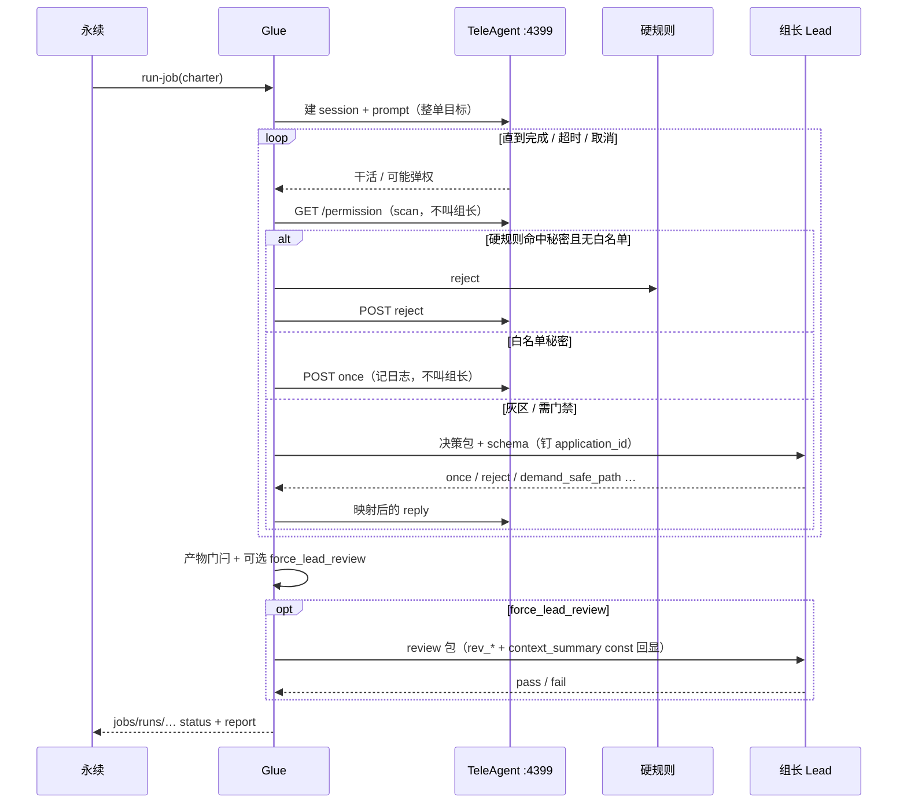
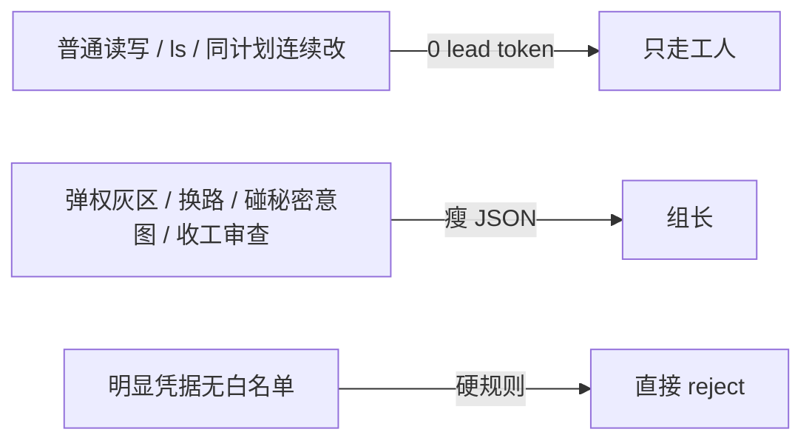

# Glue 层架构：永续编排 × 工人 × 组长

> 给老板看的理解稿（对照当前 `main` tip，含 lead 回包钉死 `3e4526f`）。  
> 不是实现规格的逐字替代；细节仍以各专题文档为准。

## 一句话

**TeleAgent 是便宜工人**（本地 HTTP `:4399` 真干活）；**Grok / 其它 Lead 是可插拔组长**（只在门禁分叉上收瘦 JSON）；**glue / scheduler 是胶水**（章程驱动、硬规则先行、扫描 ≠ 叫组长、产物+绑定验收）。

## 角色怎么分

| 角色 | 谁 | 干什么 | 不干什么 |
| --- | --- | --- | --- |
| **永续 / 编排** | 你、幕僚长、脚本、`run-job` | 写章程、开跑、收 `jobs/runs` | 不靠长口头提示词当唯一契约 |
| **Glue** | `src/glue.py` 等 | 建会话、投 prompt、扫权限、硬规则、组决策包、验收、落报告 | 不替工人写业务代码；不把 CoT 灌给组长 |
| **工人** | TeleAgent GUI→SAC `:4399` | 在 workdir 里执行整单自然语言目标 | 不自己当安全裁判；弹权等 glue 回 |
| **组长** | Grok CLI / inprocess / … | 只看瘦决策包，回 `once\|reject\|deny_job\|demand_safe_path` 或收工 `pass\|fail` | 不拆单、不改文件、不跑 bash（lead 路径禁工具） |

记忆里的编排口径：**整单自然语言给工人；Grok 只在弹权 / 换路 / 收工收瘦包出结构化 JSON。**

## 单次工单主路径

## Glue 里几块硬骨头（读代码时认路）

| 模块 | 路径（约） | 要点 |
| --- | --- | --- |
| 章程 | `src/charter.py` | 机械字段；`allow_*` 喂硬规则 |
| 硬规则 | `src/hard_rules.py` | 默认拒凭据；白名单例外；`always`+秘密永拒 |
| 工人环 | `src/glue.py` | session、权限、本轮 `finish`、lead_review |
| 调度 | `src/scheduler.py` | 多单并行；**scan ≠ call_lead**；串行弹权 |
| 组长协议 | `src/lead_adapter/` | schema / validate / grok_cli；`application_id`+`context_summary` 绑定 |
| 完成判定 | `src/completion.py` | 缺产物 / error / 超时 ≠ 成功；返工预算 |
| 适配工人 HTTP | `src/teleagent_adapter/` | Linux local-v1；Win 当前 blocked |
| 入口 | `bin/run-job.py`、`bin/run-scheduler.py` | 永续只认章程 + 收件目录 |

## 组长回包为什么要钉死

Live Grok 曾出现：`verdict` 有了但 `application_id` 空 → `application_id_mismatch` 整单 fail。  
现策略（`3e4526f`）：**schema `const` 钉死**请求里的 `application_id` / `context_summary`，提示词要求原样回显；生产路径**不**靠 glue 瞎补 id。校验失败 → safe-stop，不放宽门禁。

## 和「谁烧额度」的关系

- 工人 TeleAgent：按门户模型档 + `queryID` 计费（如 chat-pro）。  
- 组长 Grok Build：只在门禁事件调用，故意控次数。  
- 本机说明文档 / 小改：工坊自己写，**不必派工人、不必烧 Grok Build**。

## 部署形态（对照你现在的机器）

| 环境 | 工人 | 组长 | 备注 |
| --- | --- | --- | --- |
| 工坊本机 | TeleAgent 2.5.0 → `:4399` | `/workspace/run-grok.sh` | 已跑通迷你真机 |
| `mde.museling.fans:2222` | 已装 2.5.0 + Xvfb/VNC；**登录后才有 :4399** | 尚未作为日常 lead 主机 | collab 在 `/opt/collab/teleagent-collab` @ `3e4526f` |

## 专题索引（再往下挖）

| 想搞清… | 看 |
| --- | --- |
| 章程怎么写 / 怎么开跑 | [`eternal-worker-skeleton.md`](eternal-worker-skeleton.md) |
| 何时问组长、决策包字段 | [`lead-feed.md`](lead-feed.md) |
| Lead 协议与绑定 | [`lead-adapter.md`](lead-adapter.md) |
| 并行与 scan≠lead | [`parallel-scheduler.md`](parallel-scheduler.md) |
| 完成 / 验收门闩 | [`completion-criteria.md`](completion-criteria.md) |
| 工人 HTTP 契约 | [`teleagent-worker-contract.md`](teleagent-worker-contract.md) |
| 授权范围 file vs install | [`task-authorization.md`](task-authorization.md) |

## 刻意不做的事

- 不用 glue 重造 IDE / 陪伴记忆  
- 不把密钥、session 日志推进 Git  
- 不靠「降全局权限 / yolo / always-approve」换过关  
- Windows TeleAgent 工人自动化仍 blocked（另线）
